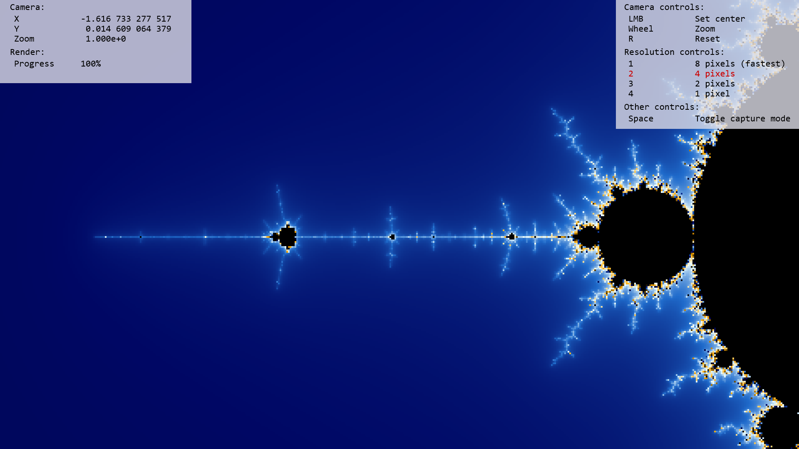

# Mandelbrot

Renders beautiful images of the Mandelbrot set.
Built with JavaScript and web workers.

## Setup
This project nothing more than a static webpage with a vanilla JS script and a web worker. Chrome does not support loading local web workers, so if you're using a Chromium browser you'll have to host the webpage with something like `python -m http.server`. Otherwise you can just open the html file with Firefox.

## Renders

`{x: -1.05, y: .305, zoom: .5}`

`{x: -1.256, y: .381, zoom: .02}`

`{x: -1.254495724, y: 0.381841248, zoom: 1.192e-7}`

`{x: -1.254495724, y: 0.381841248, zoom: 3.815e-6}`

